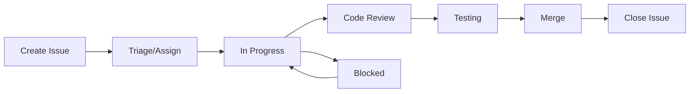

# Multi-Agent Coordination Guide

This guide explains how to coordinate work across multiple Claude Code agents working on different parts of the trivia app.

## Overview

The trivia app is developed using multiple specialized agents:
- **Database Agent**: Schema changes, migrations, queries
- **Frontend Agent**: End-user UI/UX features  
- **Admin Agent**: Admin dashboard features
- **API Agent**: Backend endpoints (any agent can handle)

## Coordination Workflow

### 1. Creating Issues

Always create GitHub issues before starting work:
1. Choose the appropriate issue template
2. Fill out all required fields
3. Add proper labels (area, type, priority)
4. Link dependencies using issue numbers

### 2. Issue Dependencies

Use these patterns in issue descriptions:
- `Depends on: #123` - This issue needs #123 completed first
- `Blocks: #456` - This issue blocks #456 from starting
- `Related to: #789` - This issue is related but not blocking

### 3. Working with Multiple Agents

#### Starting a Session
```bash
# Database agent session
claude code --session db-agent

# Frontend agent session  
claude code --session frontend-agent

# Admin agent session
claude code --session admin-agent
```

#### Agent Handoffs
1. Complete your work and push to a branch
2. Update the issue with your progress
3. Tag the next agent needed: `@agent:frontend ready for UI implementation`

### 4. Coordination Files

Always keep these files updated:

- `/docs/api/endpoints.md` - API contract documentation
- `/docs/database/schema.md` - Current database schema
- `/docs/database/migrations.md` - Migration history
- `/CLAUDE.md` - Project-specific instructions

### 5. Branch Strategy

```
main
├── db/add-favorites-table (#123)
├── api/favorites-endpoint (#124) 
├── frontend/favorites-ui (#125)
└── admin/moderate-favorites (#126)
```

### 6. Communication Patterns

#### Database → API
1. Database agent creates schema PR
2. Updates `/docs/database/schema.md`
3. Creates API issue with schema details
4. API agent implements based on schema

#### API → Frontend
1. API agent implements endpoint
2. Updates `/docs/api/endpoints.md` 
3. Creates frontend issue with API details
4. Frontend agent uses documented endpoints

#### Frontend ↔ Admin
1. Shared API endpoints documented
2. Coordinate on data formats
3. Reuse types/interfaces where possible

## Issue Lifecycle



## Best Practices

1. **One Agent, One Focus**: Each agent should focus on their domain
2. **Document Everything**: Update coordination files immediately
3. **Small PRs**: Make small, focused pull requests
4. **Test Interfaces**: Test API contracts thoroughly
5. **Communicate Blocks**: Update issues immediately when blocked

## Common Scenarios

### Adding a New Feature

1. Create epic issue describing the feature
2. Break down into sub-issues:
   - Database schema changes
   - API endpoints needed
   - Frontend implementation
   - Admin features (if needed)
3. Add proper dependencies between issues
4. Assign to appropriate agents

### Fixing a Production Bug

1. Create bug issue with P0/P1 priority
2. Add `hotfix` label
3. Assign to agent based on area
4. Fast-track through review process

### Database Migration

1. Database agent creates migration issue
2. Lists all affected code in issue
3. Creates draft PR with schema changes
4. Other agents prepare branches
5. Coordinate deployment timing

## Troubleshooting

### Merge Conflicts
- Pull latest main before starting work
- Communicate in issues about conflicting work
- Use feature flags for gradual rollout

### Dependency Confusion
- Check `/docs/` for latest contracts
- Verify issue dependencies are correct
- Ask in issue comments if unclear

### API Contract Mismatch
- API agent must update docs first
- Frontend/admin agents work from docs
- Test with actual API before merging