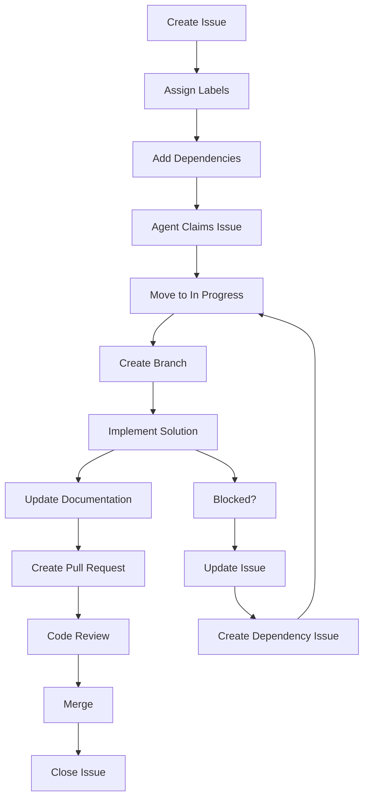

# Multi-Agent Development Workflow

This document outlines the complete workflow for coordinating development across multiple Claude Code agents working on different computers.

## Quick Start

1. **Create Issues First**: Always create GitHub issues before starting work
2. **Use Session Names**: Start Claude Code with consistent session names
3. **Update Documentation**: Keep coordination files current
4. **Communicate via Issues**: Use issue comments for agent coordination

## Session Commands

```bash
# Database work
claude code --session db-agent

# Frontend end-user features  
claude code --session frontend-agent

# Admin dashboard features
claude code --session admin-agent
```

## Issue-Driven Development

### 1. Creating Work Items

Choose the appropriate issue template:
- **Frontend Feature**: End-user features, UI/UX
- **Admin Dashboard Feature**: Admin interface work
- **Database Change**: Schema, migrations, queries
- **API Endpoint**: Backend API development
- **Bug Report**: Issues in any area

### 2. Issue Lifecycle



### 3. Dependency Management

Use these patterns in issue descriptions:

**Dependency Declarations**:
```markdown
## Dependencies
Depends on:
- #123 (Database schema for user preferences)
- #124 (API endpoint for preferences)

Blocks:
- #125 (Frontend preferences UI)
- #126 (Admin user management)

Related to:
- #127 (Mobile push notifications)
```

**Status Updates**:
```markdown
## Progress Update
✅ Database schema completed
⏳ API endpoint in progress
❌ Blocked by #128 (authentication issue)
```

## Agent Coordination Patterns

### Database → API → Frontend Flow

1. **Database Agent**:
   - Creates schema migration
   - Updates `/docs/database/schema.md`
   - Creates API issue with schema details
   - Tags: `@agent:api ready for endpoint implementation`

2. **API Agent** (any agent can handle):
   - Implements endpoint based on schema
   - Updates `/docs/api/endpoints.md`
   - Creates frontend issue with API details
   - Tags: `@agent:frontend API ready for integration`

3. **Frontend Agent**:
   - Implements UI using documented API
   - Tests integration thoroughly
   - Reports any API issues back

### Parallel Development

When features can be developed in parallel:

1. **Create Epic Issue**: Overall feature description
2. **Break into Sub-Issues**: One per agent domain
3. **Define Interfaces**: API contracts, data formats
4. **Develop Concurrently**: Each agent works on their piece
5. **Integration Testing**: Test complete feature together

### Cross-Agent Communication

**In Issue Comments**:
```markdown
@agent:database - Can you add an index on user_id for this query?

@agent:frontend - The API response format changed, see updated docs

@agent:admin - This same endpoint can be used for admin features
```

**In Pull Request Descriptions**:
```markdown
## Impact on Other Agents
- Frontend: New API endpoint available (see docs/api/endpoints.md)
- Admin: Can reuse this component for admin user list
- Database: Requires migration #123 to be merged first
```

## Branch Strategy

### Branch Naming
```
area/issue-description-number
```

Examples:
- `db/add-user-preferences-123`
- `frontend/event-favorites-124`
- `admin/venue-moderation-125`
- `api/user-preferences-endpoint-126`

### Coordination Branches
For features spanning multiple agents:
```
feature/user-preferences-epic-120
├── db/user-preferences-schema-121
├── api/user-preferences-endpoint-122
├── frontend/preferences-ui-123
└── admin/user-preference-management-124
```

## Documentation Workflow

### Required Updates

**Every Database Change**:
1. Update `/docs/database/schema.md`
2. Log migration in `/docs/database/migrations.md`
3. Update affected API docs if needed

**Every API Change**:
1. Update `/docs/api/endpoints.md`
2. Include request/response examples
3. Document authentication requirements

**Every Major Feature**:
1. Update coordination documentation
2. Add to agent-specific guides if needed
3. Update CLAUDE.md if project-wide changes

### Documentation Review
- Database agent reviews schema docs
- All agents can review API docs
- Frontend/Admin agents coordinate on shared patterns

## Pull Request Workflow

### PR Creation
1. **Descriptive Title**: `[AREA] Brief description (#issue)`
2. **Link Issue**: `Closes #123` or `Part of #123`
3. **Impact Assessment**: List affected areas
4. **Testing Notes**: How to test the changes

### PR Review Process
1. **Self-Review**: Check your own PR first
2. **Documentation Check**: Ensure docs are updated
3. **Integration Impact**: Consider effects on other work
4. **Agent Handoff**: Tag relevant agents for review

### Merge Criteria
- [ ] All tests pass
- [ ] Documentation updated
- [ ] No merge conflicts
- [ ] Issue requirements met
- [ ] Integration tested (if applicable)

## Multi-Computer Workflow

### Setting Up on New Computer
```bash
# Clone repository
git clone <repo-url>
cd trivia

# Install dependencies
cd trivia-nearby
pnpm install

# Start appropriate agent session
claude code --session frontend-agent
```

### Syncing Work Between Computers
```bash
# Push current work
git add .
git commit -m "WIP: implementing user preferences UI"
git push origin frontend/user-preferences-123

# On other computer
git fetch origin
git checkout frontend/user-preferences-123
```

### Handoff Protocol
1. **Commit Current State**: Even if incomplete
2. **Update Issue**: Document progress and next steps
3. **Push Branch**: Make work available
4. **Tag Agent**: `@agent:frontend ready for continuation`

## Common Scenarios

### 1. Adding a Complete New Feature
```markdown
Epic: User Event Favorites (#100)

Sub-issues:
- [ ] Add favorites table to database (#101) - @agent:database
- [ ] Create favorites API endpoints (#102) - @agent:api  
- [ ] Implement favorites UI (#103) - @agent:frontend
- [ ] Add admin favorites management (#104) - @agent:admin

Dependencies:
#101 → #102 → #103
#102 → #104
```

### 2. Fixing a Production Bug
```markdown
Bug: Event search returns incorrect results (#200)

Investigation:
- [ ] Check database query performance (#201) - @agent:database
- [ ] Verify API response format (#202) - @agent:api
- [ ] Test frontend search logic (#203) - @agent:frontend

Priority: P0 - Production impact
```

### 3. Performance Optimization
```markdown
Epic: Improve event search performance (#300)

Tasks:
- [ ] Add database indexes (#301) - @agent:database
- [ ] Implement API caching (#302) - @agent:api
- [ ] Add frontend result caching (#303) - @agent:frontend
- [ ] Optimize admin event queries (#304) - @agent:admin

Parallel work possible after #301 completed.
```

## Troubleshooting

### Merge Conflicts
1. **Coordinate**: Discuss in relevant issues
2. **Rebase**: Use `git rebase main` to update branch
3. **Test**: Ensure functionality still works
4. **Document**: Note any breaking changes

### API Contract Issues
1. **Check Documentation**: Verify `/docs/api/endpoints.md`
2. **Test Endpoints**: Use API testing tools
3. **Update Issues**: Report discrepancies
4. **Coordinate Fix**: Work with API implementer

### Database Migration Problems
1. **Check Schema Docs**: Verify current state
2. **Review Migration Log**: Check recent changes
3. **Test Locally**: Use local Supabase instance
4. **Rollback Plan**: Have rollback ready

### Agent Confusion
1. **Check Issue Labels**: Verify agent assignments
2. **Read Agent Guides**: Review role responsibilities
3. **Ask in Issues**: Use comments for clarification
4. **Update Documentation**: Improve unclear processes

## Best Practices

### Communication
- **Be Explicit**: Clearly state dependencies and requirements
- **Update Frequently**: Keep issues current with progress
- **Document Decisions**: Record important technical choices
- **Share Context**: Include enough detail for other agents

### Code Quality
- **Follow Conventions**: Use existing patterns
- **Write Tests**: Especially for integration points
- **Document APIs**: Keep endpoint docs current
- **Consider Performance**: Think about multi-agent impact

### Coordination
- **Small PRs**: Easier to review and merge
- **Frequent Updates**: Don't let branches get stale
- **Clear Interfaces**: Well-defined API contracts
- **Test Integration**: Verify cross-agent functionality

### Planning
- **Break Down Work**: Make issues manageable
- **Identify Dependencies**: Plan work order
- **Estimate Impact**: Consider cross-agent effects
- **Plan Testing**: Include integration testing