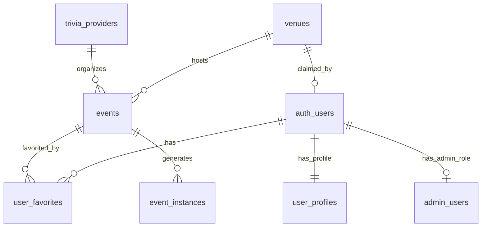

# Database Schema Documentation

Current database schema for the trivia app. Update this whenever schema changes are made.

## Overview

- Database: PostgreSQL with PostGIS extension
- Location: Supabase hosted
- Key features: Spatial queries, RLS policies, real-time subscriptions

## Tables

### venues
Stores information about trivia venues.

```sql
CREATE TABLE venues (
    id UUID PRIMARY KEY DEFAULT gen_random_uuid(),
    name VARCHAR(255) NOT NULL,
    address TEXT NOT NULL,
    city VARCHAR(100),
    state VARCHAR(2),
    zip VARCHAR(10),
    country VARCHAR(2) DEFAULT 'US',
    location GEOGRAPHY(POINT, 4326), -- PostGIS point
    phone VARCHAR(20),
    email VARCHAR(255),
    website TEXT,
    photo_url TEXT,
    google_place_id VARCHAR(255) UNIQUE,
    facebook_url TEXT,
    instagram_url TEXT,
    operating_hours JSONB, -- {"monday": {"open": "11:00", "close": "23:00"}, ...}
    is_active BOOLEAN DEFAULT true,
    is_verified BOOLEAN DEFAULT false,
    claimed_by UUID REFERENCES auth.users(id),
    created_at TIMESTAMPTZ DEFAULT NOW(),
    updated_at TIMESTAMPTZ DEFAULT NOW(),
    
    -- Indexes
    INDEX idx_venues_location USING GIST (location),
    INDEX idx_venues_active (is_active) WHERE is_active = true,
    INDEX idx_venues_google_place (google_place_id) WHERE google_place_id IS NOT NULL
);
```

### events
Stores trivia events.

```sql
CREATE TABLE events (
    id UUID PRIMARY KEY DEFAULT gen_random_uuid(),
    venue_id UUID NOT NULL REFERENCES venues(id) ON DELETE CASCADE,
    provider_id UUID REFERENCES trivia_providers(id),
    name VARCHAR(255) NOT NULL,
    description TEXT,
    start_time TIMESTAMPTZ NOT NULL,
    end_time TIMESTAMPTZ,
    recurrence_rule TEXT, -- iCal RRULE format
    recurrence_end_date DATE,
    prize_info TEXT,
    registration_required BOOLEAN DEFAULT false,
    registration_link TEXT,
    max_team_size INTEGER,
    entry_fee DECIMAL(10,2),
    categories TEXT[], -- ['general', 'themed', 'music']
    difficulty VARCHAR(20), -- easy, medium, hard
    is_active BOOLEAN DEFAULT true,
    external_id VARCHAR(255), -- Provider's event ID
    source_url TEXT,
    created_by UUID REFERENCES auth.users(id),
    created_at TIMESTAMPTZ DEFAULT NOW(),
    updated_at TIMESTAMPTZ DEFAULT NOW(),
    
    -- Indexes
    INDEX idx_events_venue (venue_id),
    INDEX idx_events_start_time (start_time),
    INDEX idx_events_active (is_active) WHERE is_active = true,
    INDEX idx_events_recurring (recurrence_rule) WHERE recurrence_rule IS NOT NULL,
    UNIQUE INDEX idx_events_external (provider_id, external_id) WHERE external_id IS NOT NULL
);
```

### trivia_providers
Organizations that run trivia events.

```sql
CREATE TABLE trivia_providers (
    id UUID PRIMARY KEY DEFAULT gen_random_uuid(),
    name VARCHAR(255) NOT NULL UNIQUE,
    website TEXT,
    email VARCHAR(255),
    phone VARCHAR(20),
    logo_url TEXT,
    description TEXT,
    service_areas TEXT[], -- ['TN', 'GA', 'AL']
    api_endpoint TEXT,
    api_key_encrypted TEXT,
    scraping_config JSONB, -- Configuration for scraping
    is_active BOOLEAN DEFAULT true,
    last_sync_at TIMESTAMPTZ,
    created_at TIMESTAMPTZ DEFAULT NOW(),
    updated_at TIMESTAMPTZ DEFAULT NOW()
);
```

### users (extends Supabase auth.users)
Additional user profile data.

```sql
CREATE TABLE user_profiles (
    id UUID PRIMARY KEY REFERENCES auth.users(id) ON DELETE CASCADE,
    display_name VARCHAR(100),
    avatar_url TEXT,
    location GEOGRAPHY(POINT, 4326),
    location_name VARCHAR(255), -- "Nashville, TN"
    notification_radius INTEGER DEFAULT 10, -- miles
    favorite_categories TEXT[],
    created_at TIMESTAMPTZ DEFAULT NOW(),
    updated_at TIMESTAMPTZ DEFAULT NOW()
);
```

### user_favorites
Users' favorite events.

```sql
CREATE TABLE user_favorites (
    user_id UUID REFERENCES auth.users(id) ON DELETE CASCADE,
    event_id UUID REFERENCES events(id) ON DELETE CASCADE,
    created_at TIMESTAMPTZ DEFAULT NOW(),
    PRIMARY KEY (user_id, event_id)
);
```

### admin_users
Admin access control.

```sql
CREATE TABLE admin_users (
    id UUID PRIMARY KEY DEFAULT gen_random_uuid(),
    user_id UUID REFERENCES auth.users(id) ON DELETE CASCADE,
    role VARCHAR(50) NOT NULL, -- super_admin, venue_admin, moderator
    permissions JSONB, -- {"venues": ["read", "write"], "events": ["read"]}
    created_by UUID REFERENCES auth.users(id),
    created_at TIMESTAMPTZ DEFAULT NOW(),
    updated_at TIMESTAMPTZ DEFAULT NOW(),
    
    UNIQUE(user_id)
);
```

### event_instances
Materialized view for recurring events (generated daily).

```sql
CREATE MATERIALIZED VIEW event_instances AS
SELECT 
    e.id as event_id,
    e.venue_id,
    e.name,
    generate_series(
        e.start_time,
        LEAST(e.recurrence_end_date, CURRENT_DATE + INTERVAL '30 days'),
        '1 week'::interval
    ) as instance_date,
    e.prize_info,
    v.location
FROM events e
JOIN venues v ON e.venue_id = v.id
WHERE e.is_active = true 
  AND e.recurrence_rule IS NOT NULL;

CREATE INDEX idx_event_instances_date ON event_instances(instance_date);
CREATE INDEX idx_event_instances_location ON event_instances USING GIST(location);
```

## Key Relationships



## RLS Policies

### venues
- SELECT: Anyone can view active venues
- INSERT: Authenticated users only
- UPDATE: Venue owner or admin only
- DELETE: Admin only

### events  
- SELECT: Anyone can view active events
- INSERT: Authenticated users only
- UPDATE: Event creator, venue owner, or admin
- DELETE: Admin only

### user_favorites
- SELECT: User can see own favorites
- INSERT/DELETE: User can manage own favorites

### admin_users
- SELECT/INSERT/UPDATE/DELETE: Super admin only

## Functions & Triggers

### Updated Timestamp
```sql
CREATE OR REPLACE FUNCTION update_updated_at()
RETURNS TRIGGER AS $$
BEGIN
    NEW.updated_at = NOW();
    RETURN NEW;
END;
$$ LANGUAGE plpgsql;

-- Applied to all tables with updated_at
```

### Nearby Events Function
```sql
CREATE OR REPLACE FUNCTION get_events_nearby(
    user_lat FLOAT,
    user_lng FLOAT,
    radius_miles INTEGER DEFAULT 10
)
RETURNS TABLE (
    event_id UUID,
    venue_id UUID,
    event_name VARCHAR,
    venue_name VARCHAR,
    distance_miles FLOAT,
    start_time TIMESTAMPTZ
) AS $$
BEGIN
    RETURN QUERY
    SELECT 
        e.id,
        e.venue_id,
        e.name,
        v.name,
        ST_Distance(
            v.location,
            ST_MakePoint(user_lng, user_lat)::geography
        ) / 1609.34 as distance_miles,
        e.start_time
    FROM events e
    JOIN venues v ON e.venue_id = v.id
    WHERE v.is_active = true
      AND e.is_active = true
      AND ST_DWithin(
            v.location,
            ST_MakePoint(user_lng, user_lat)::geography,
            radius_miles * 1609.34
        )
    ORDER BY distance_miles;
END;
$$ LANGUAGE plpgsql;